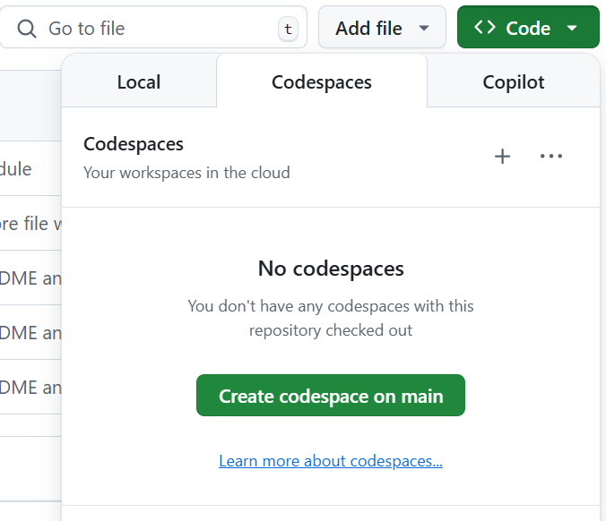
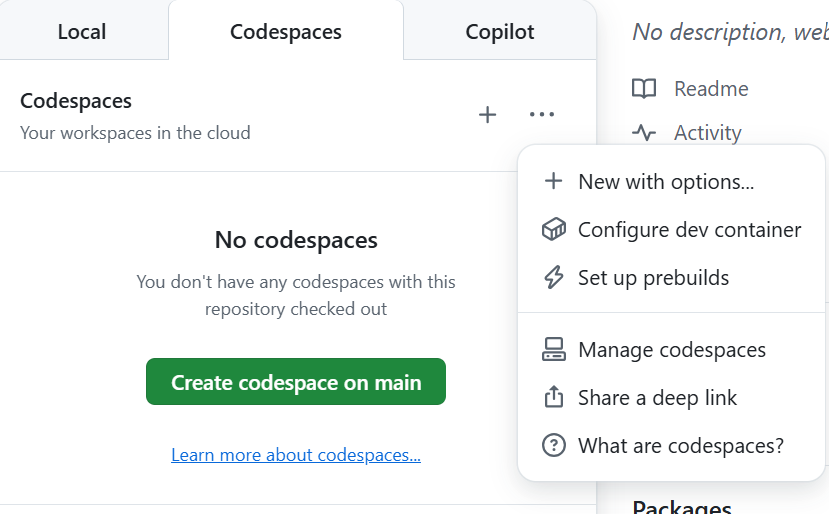
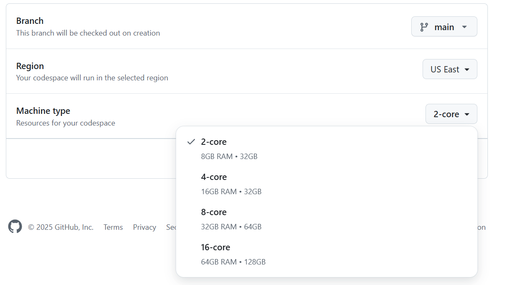

# LLM Inference: Introduction to Optimization and Efficiency Lab

This lab is designed to introduce participants to techniques for optimizing and improving the efficiency of large language model (LLM) inference. It covers practical methods for reducing latency, improving throughput, and leveraging tools and frameworks to achieve efficient inference.

## Objectives

- Understand the basics of LLM inference and its challenges.
- Learn optimization techniques for LLM inference, including quantization and distillation.
- Set up and run inference pipelines in various environments, including GitHub Codespaces and local setups.
- Discuss the use of tools like Ray, ONNX and Hugging Face Optimum for efficient inference.

## Prerequisites
Software dependencies to support the work.

- Python 3.11+
- Install [vscode](https://code.visualstudio.com/)
- (Optional) Install [pyenv](https://github.com/pyenv/pyenv?tab=readme-ov-file#installation) 
- Install [poetry](https://python-poetry.org/docs/#installation)

Here is a really great Medium article on setup with pyenv and poetry: [Proper Python setup with pyenv & Poetry](https://douwevandermeij.medium.com/proper-python-setup-with-pyenv-poetry-4d8baea329a8)

## Code Pre-requisites

Ensure the following dependencies are installed in your environment:

- Python 3.11 or higher
- `pandas` (v2.2.3)
- `polars` (v1.29.0)
- `torch` (v2.7.0)
- `transformers` (v4.51.3)
- `datasets` (v3.5.1)
- `onnx` (v1.17.0)
- `optimum` (v1.24.0)
- `ray` (v2.45.0)
- `ipykernel` (v6.29.5)
- `huggingface-hub` (v0.30.2)

These dependencies are already listed in the `pyproject.toml` file and can be installed using Poetry.

## Getting Started

1. Clone the repository:
   ```bash
   git clone <repository-url>
   cd llm-inference-lab
   ```

2. Create a directory to point the virtual environment created by Poetry in your project directory
   ```bash
   mkdir .venv
   ```

3. Install dependencies using Poetry:
   ```bash
   poetry install
   ```

   Verify virtual environment: `poetry env list --full-path`

4. Activate the environment:
   ```bash
   poetry shell
   ```

   If using `Codespace`, activate the environment by running:
   ```bash
   poetry env activate
   ```

5. Add environment to Jupyter kernelspec to use in Notebook
   ```bash
   python -m ipykernel install --user --name .venv
   ```

6. Open the Jupyter Notebook: ~/llm_inference_lab/notebooks/inference_optimize.ipynb

7. In Jupyter Notebook, select Kernel to be the poetry virtual environment that should have been created following Step 3.

## Environment Setup

### GitHub Codespaces

1. Open the repository in GitHub Codespaces.

2. **Do not click the green button yet!** Select the three dots and select *New with options...*.

3. Next change Machine Type to 16-core.

4. Now click on **Create codespace**.
5. Follow the steps in the "Getting Started" section to set up the environment and run the notebook. **No need to run git clone, just make sure you are in the project directory.**

### Local Setup

1. Ensure Python 3.11 or higher is installed on your system.
2. Install "Prerequisites"
3. Follow the steps in the "Getting Started" section to set up the environment and run the notebook.

### Additional VSCode Extensions:
- Jupyter
- Jupyter Cell Tags
- Jupyter Notebook Renderers

With these steps, you are ready to explore optimization techniques for LLM inference!
